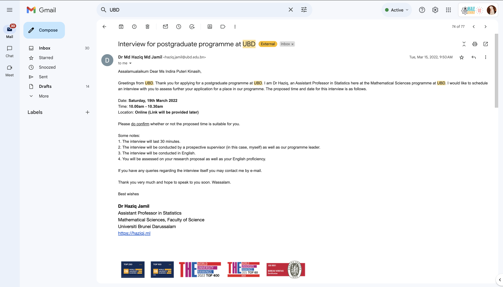

# {background-image=figs/journey.png background-opacity="0.6" background-size="90%"}

# Recipe & Ingredients{background-image=figs/fos2.jpg background-opacity="0.2"}

## Preparing Your Application: *a must read recipe*

### Key Links
- **Scholarship Details:** [UBD Graduate Research Scholarship](https://ubd.edu.bn/admission/graduate/graduate-fees-funding/ugrs/) and [UBD Bursary Award](https://ubd.edu.bn/admission/graduate/graduate-fees-funding/ubd-bursary-award/)

- **Entry Requirements:** [Graduate Entry Requirements](https://ubd.edu.bn/admission/graduate/graduate-entry-requirements/)
- [**Online admission link**](https://apply.ubd.edu.bn/orbeon/uis-welcome/)

## Preparing Your Application: *the ingredients*
- **Academic CV**:
  - Highlight **academic achievements**
  - Include research experience and **publications**
- **Research proposal**:
  - Clear objectives and methodology
  - Connect with potential supervisors (optional)
- **Personal statement**:
  - Tailor to UBD requirements
  - Explain your motivation and alignment with UBD’s research strengths
- **Letters of recommendation**:
  - Request early!
  - Choose recommenders who know your work well

---

## Key preparation points
1. **Review UBD Research Strengths:**
   - Explore research areas and active projects at UBD.
   - Examples of strengths:
     - Biodiversity research in the Borneo region.
     - Climate change mitigation and renewable energy.
     - ASEAN regional studies and cultural preservation.
   - Align your proposal with these research priorities.

2. **Engage with Potential Supervisors Early:**
   - **Why?**: Strong recommendations from supervisors can increase your chances.
   - Identify faculty whose expertise aligns with your research interests.
   - Approach them with a concise introduction and your research idea.
--- 

## Key preparation points (contd')

3. **Highlight Alignment with UBD’s Strategic Goals:**
   - Address how your research supports Brunei Vision 2035:
     - Sustainability (e.g., environmental conservation, clean energy).
     - Economic diversification (e.g., technology, entrepreneurship).
     - Regional collaboration in ASEAN and beyond.
---

## Example
Have time to explore your *'home'* wannabe

- [Faculty website: Mathematical Science](https://fos.ubd.edu.bn/disciplines/maths/30-phd/#areas-of-research)

- [Faculty academic member](https://fos.ubd.edu.bn/academics/)

- [Prospective supervisors website (if available)](https://haziqj.ml/)

# The interview {.small-font .transition-slide}
*"nervous is normal, preparation is a must!"*

## Academic Interview Preparation
- **What to expect**:
  - Discuss your research proposal
  - Explain why UBD is your choice
  - Address your long-term goals
  - Assess your communication skills, including english skills
  - will not more than 30 minutes

{.center width=70%}  

## Academic Interview Preparation(contd')
- **Practical tips**:
  - Practice common questions (e.g., *"Why this research?"*, *"how much you've explored this topic?"*);
  - Be open to discuss about the possibility of how your research data will be gained (in general);
  - Be clear and concise;
  - Prepare to discuss your CV and academic background in depth
  - Understand the question(s);
  - be truthful, academically!

---

## Common Questions in Interviews
- Examples of common questions:
  - *Why do you want to pursue a PhD?*
  - *How does your research align with UBD?*
  - *What challenges do you anticipate, and how will you handle them?*
  - *What are your career goals after the PhD?*

---

## Final Tips
- Time management:
  - Start applications early
  - Practice interviews with peers or mentors
- Communication:
  - Be **clear** and **specific** in your application and interviews
  - Show confidence and enthusiasm
- Stay organised:
  - Track deadlines and requirements
  - Prepare documents systematically

# Remember{background-image=figs/fig3.jpg background-opacity="0.4"}
*"each journey is unique. Enjoy yours and prepare for the worst :)"*

# Good luck and thank you :){background-image=figs/fig2.jpg background-opacity="0.4"}
