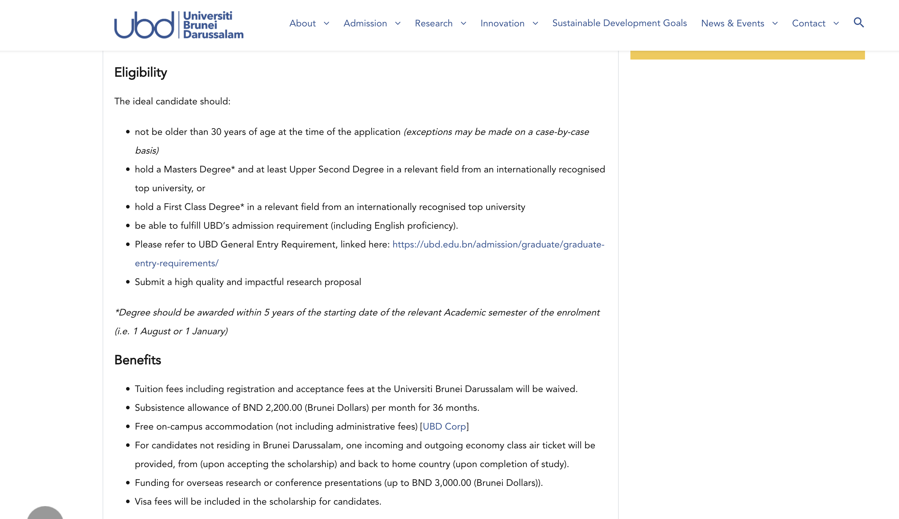
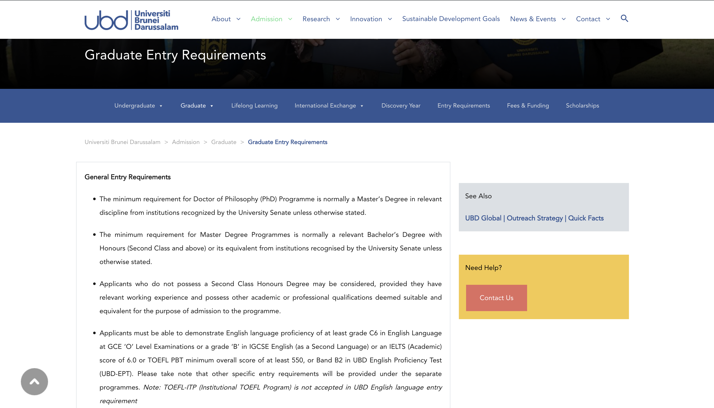
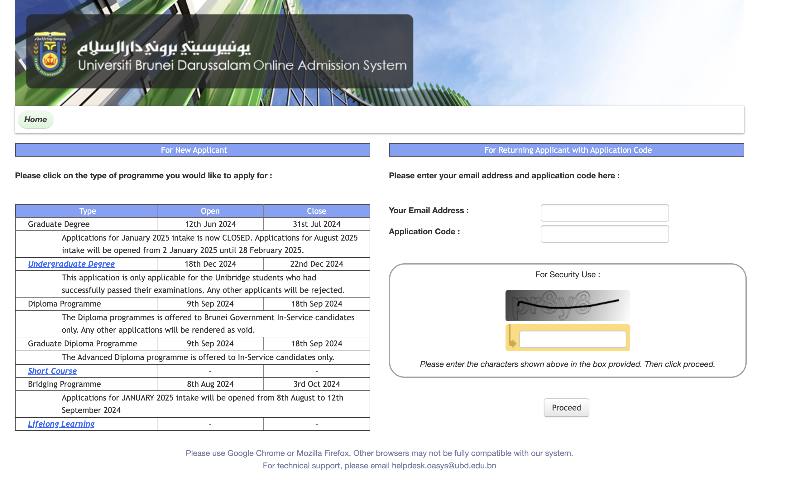
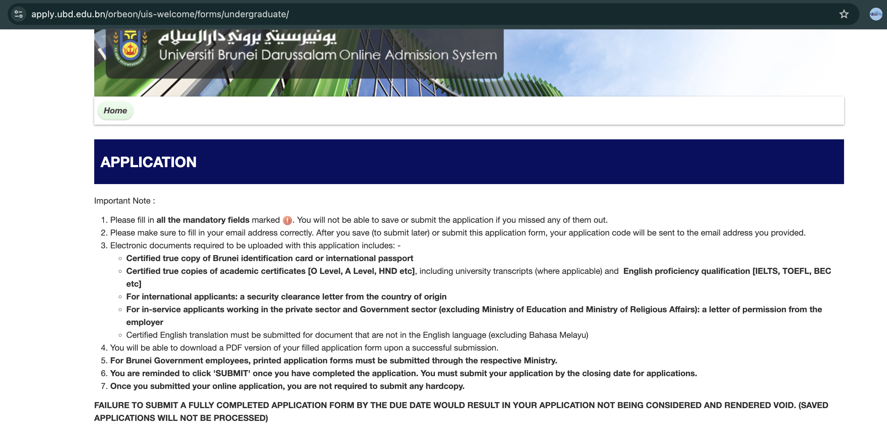
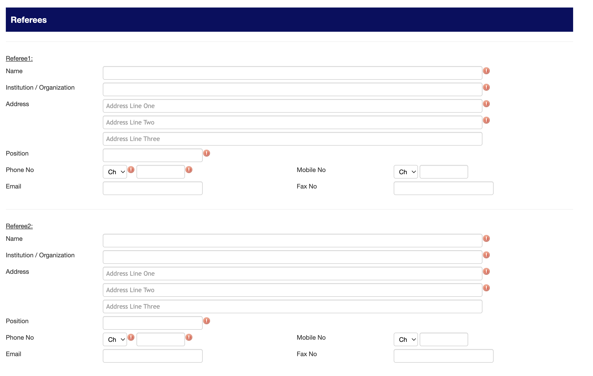

# The Journey{background-image="figs/journey.png" background-opacity="0.6" background-size="95%"}

# Recipe & Ingredients {background-image="figs/fos2.jpg" background-opacity="0.2"}

## Preparing Your Application: *a must read recipe* {.smaller .scrollable transition="slide"}

### Key Links

-   **Scholarship Details:** [UBD Graduate Research Scholarship](https://ubd.edu.bn/admission/graduate/graduate-fees-funding/ugrs/) and [UBD Bursary Award](https://ubd.edu.bn/admission/graduate/graduate-fees-funding/ubd-bursary-award/) {.center width="85%"}

-   **Entry Requirements:** [Graduate Entry Requirements](https://ubd.edu.bn/admission/graduate/graduate-entry-requirements/) {.center width="85%"}

-   [**Online admission link**](https://apply.ubd.edu.bn/orbeon/uis-welcome/) {.center width="85%"} {.center width="85%"}

## Preparing Your Application: *the ingredients* {.smaller .scrollable transition="slide"}

-   [**Academic CV**](https://drive.google.com/drive/folders/1Ynlg0P-ITDnnNslWZPym-9DElV3ndJgk?usp=sharing):
    -   Highlight **academic achievements**
    -   Include research experience and **publications**
-   **Research proposal**:
    -   Clear objectives and methodology
    -   Connect with potential supervisors (optional)
-   [**Personal statement**](https://drive.google.com/drive/folders/1Ynlg0P-ITDnnNslWZPym-9DElV3ndJgk?usp=sharing):
    -   Tailor to UBD requirements
    -   Explain your motivation and alignment with UBD’s research strengths
-   **Letters of recommendation**:
    -   Request early!
    -   Choose recommenders who know your work well {.center width="85%"}

------------------------------------------------------------------------

## Key preparation points {.smaller .scrollable transition="slide"}

1.  **Review UBD Research Strengths:**
    -   Explore research areas and active projects at UBD.

        #### **The UGRS will prioritise funding for high impact research within the current research thrusts of UBD and Brunei including (but not limited to):** Energy, Material Science, Biodiversity, Data Analytics, Asian and Islamic Studies, Bioinspiration, Climate Change, Herbal Medicine, Sensor Technology and Catalysis.

    -   Align your proposal with these research priorities.
    
2.  **Engage with Potential Supervisors Early:**
    -   **Why?**: Strong recommendations from supervisors can increase your chances.
    -   Identify faculty whose expertise aligns with your research interests.
    -   Approach them with a concise introduction and your research idea.

## Example {.smaller .scrollable transition="slide"}

Have time to explore your *'home'* wannabe

-   [Faculty website: Mathematical Science](https://fos.ubd.edu.bn/disciplines/maths/30-phd/#areas-of-research)

-   [Faculty academic member](https://fos.ubd.edu.bn/academics/)

-   [Prospective supervisors website (if available)](https://haziqj.ml/)

# The interview {.small-font .transition-slide}

*"nervous is normal, preparation is a must!"*

## Academic Interview Preparation

{.center width="70%"}

**What to expect**:

    -   Discuss your research proposal
    -   Explain why UBD is your choice
    -   Address your long-term goals
    -   Assess your communication skills, including english skills
    -   will not last more than 30 minutes

## Academic Interview Preparation(contd')

-   **Practical tips**:
    -   Practice common questions (e.g., *"Why this research?"*, *"how much you've explored this topic?"*);
    -   Be open to discuss about the possibility of how your research data will be gained (in general);
    -   Be clear and concise;
    -   Prepare to discuss your CV and academic background in depth
    -   Understand the question(s);
    -   Be truthful!

------------------------------------------------------------------------

## Common Questions in Interviews

-   Examples of common questions:
    -   *Why do you want to pursue a PhD?*
    -   *How does your research align with UBD?*
    -   *What challenges do you anticipate, and how will you handle them?*
    -   *What are your career goals after the PhD?*
- *Note*:For the latest process (though it may vary), there are typically two separate interviews: the first with a faculty member and the second with the graduate admissions committee.

------------------------------------------------------------------------

## Final Tips

-   Time management:
    -   Start applications early
    -   Practice interviews with peers or mentors
-   Communication:
    -   Be **clear** and **specific** in your application and interviews
    -   Show confidence and enthusiasm
-   Stay organised:
    -   Track deadlines and requirements
    -   Prepare documents systematically

# Remember {background-image="figs/fig3.jpg" background-opacity="0.4"}

*"each journey is unique. Enjoy yours and always prepare for the worst :)"*

# Good luck and thank you :) {background-image="figs/fig2.jpg" background-opacity="0.4"}
